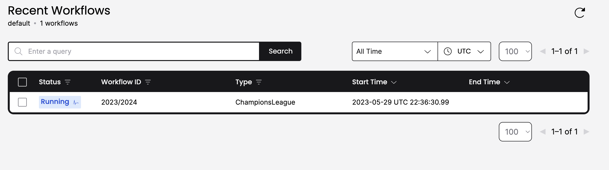

# Kick-off 

UEFA Champions league is structured in two parts: the *group stage* and the *knockout phase*. As engineers, we are horrified by the idea of encoding such complex business logic in a single place. It's hard to develop, maintain and test. We are going to address these concerns in future chapters, let's now get our first workflow running.

Since we are using Temporal GoLang SDK, for us a Workflow is just a function. It takes a `workflow.Context` parameter and workflow parameters. A workflow with no input parameter is pretty useless. In our case, we will pass the collection of participating team.  In case of the UEFA CL, there is a mechanism in place to avoid having groups that have many good teams, since from the business perspective and entertainment perspective it obviously makes sense to have them meet in the knockout phase!

Following Temporal best practices, we are going to use structs for input and output parameters. Extending a struct has better offers some backward compatibility, while changing the signature of our function doesn't.

```go
package chapter1

import "go.temporal.io/sdk/workflow"

type Team struct {
	Name string
}

type Pot struct {
	Teams []Team
}

type Participants struct {
	Pots   []Pot
}

type Result struct {
	Winner Team
}

func ChampionsLeague(ctx workflow.Context, participants Participants) (error, Result) {
	return nil, Result{}
}

```

## Making FC Internazionale Win

This is not an incredible change, but it's very true. FC Internazionale is the winner of the 2023/2024 edition, so let's modify the workflow code

```go
func ChampionsLeague(ctx workflow.Context, participants Participants) (error, Result) {
	return nil, Result{
		Winner: Team{Name: "FC Internazionale"},
	}
}
```

## Who triggers the beginning of the competition?

A workflow engine allows client to submit workflows, and retrieve their result. Who submit the UEFA Champions League 2023/2024? Me, clearly. I mean, not when *FC Internazionale* loses, obviously. This year however, I knew we were going to win and I had explicitly submitted the `ChampionsLeague` workflow. You can find how I submitted the workflow [here](./main/edmondo.go) but let's look together at some interesting part of the code. Please note that this is not all the submission code

```go
    // Creating a client to connect to Temporal Server
    c, err := client.Dial(client.Options{})
    if err != nil {
    log.Fatalln("Unable to create client", err)
    }
    defer c.Close()
	
	// Identify the specific queue that I want to run this workflow on, and an optional ID
    workflowOptions := client.StartWorkflowOptions{
        ID:        "2023/2024",
        TaskQueue: "champions-league",
    }
	// Submitting the workflow. The second parameter are the options, the third is the workflow function,
	// and the fourth is the workflow input
    we, err := c.ExecuteWorkflow(context.Background(), workflowOptions, chapter1.ChampionsLeague, participants)
	// Waiting for the workflow to complete
    var result chapter1.Result
    err = we.Get(context.Background(), &result)
```

Now that we have submitted the workflow (you can try yourself from the folder `chapter1/main` to run `go run edmondo.go`), we can explore the UI and see what's happening. The first, obvious insight is now that there is a workflow running



Most interestingly, once we click on the *Workflow Execution*, we can visualize some details.


Let's start from the top and understand the UI together:
1. We immediately notice that there are no worker registered. So far we haven't deployed anything that could actually take care of executing our ChampionsLeague!
2. On the top, there are multiple tabs. We'll discuss *Activities* and *Queries* in the future
3. Immediately after, we have a *Summary* section. 
4. The *Relationship* section gives us some insights on certain Temporal features, such as Children workflows
5. The *Input and Results* section allow us to inspect the input of the Workflow
6. The *Events* section let us understand more about our workflow is progressing.

This can sound a little obscure, and it was for me at the beginning, until I understood durability. But I'd like to show (silly) examples first, so let's move to implement our worker.

## Who orchestrate the the competition?

I would love to be able to manage a multinational soccer event, and get free tickets for all the matches. However, I have learnt that too often our cognitive bias lead us to underappreciate the complexity of what we don't know. I am very happy to leave the work to do to a **management team**.

That's probably the right people capable of orchestrating a long running competition. There is certainly a team behind it. 


### Workflow executions

(Most of this chapter is a copy-paste of Temporal documentation)

A Temporal Workflow Execution is a durable, reliable, and scalable function execution. I'll quote the documentation here:
- Durability is the absence of an imposed time limit.
- Reliability is responsiveness in the presence of failure.
- Scalability is responsiveness in the presence of load.

The use of Workflow APIs in a Workflow Function generates Commands. Commands tell the Cluster which Events to create and add to the Workflow Execution's Event History. When a Workflow Function executes, the Commands that are emitted are compared with the existing Event History. If a corresponding Event already exists within the Event History that maps to the generation of that Command in the same sequence, and some specific metadata of that Command matches with some specific metadata of the Event, then the Function Execution progresses

A special treatment 


