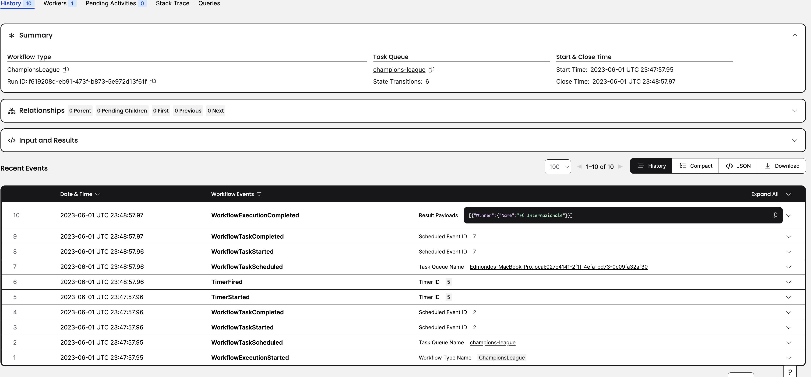
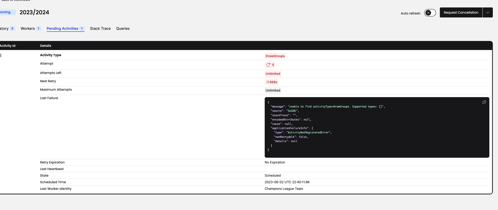

# Dealing with a scandal

The team in charge of the UEFA Champions League gets dismissed because of a corruption scandal. Ok, I know this hasn't happened in this competition, but recent events suggest this is not an impossible event. 

In complex software systems, this happens all the time: a process carrying out some work might fail, the underlying hardware might fail, the underlying availability zone might fail. Everything fails all the time. For long-running processes, it will be a real pity if we had to start processing all over again (and it might be **very expensive**)

## Introducing some suspense

We now FC Internazionale has been the winner, but for this chapter, we are going to introduce some suspense. We want the result to be returned after one hour from the beginning of the competition (so to allow bookmakers to collect some bets, obviously.)

Now what happen if you have a Java process like so that fails in the middle, and you run it again?

```java
import java.time.Duration;
import java.time.temporal.ChronoUnit;

public class ChampionsLeague {
    
    public static void main(String[] args) throws Exception{
        Duration oneHour = Duration.of(1, ChronoUnit.HOURS);
        Thread.sleep(oneHour.toMillis());
        System.out.println("FC Internazionale is the winner!");
    }
}
```

Well, you lost track of how much time the previous process was waiting when it crashed, and you will wait again for one 
hour.  

### Understanding Workflow Executions

(Please refer to Temporal documentation for a less "layman" explanation of this topic)

If you want to make your workflow durable and reliable, you can't rely on local state. The store need to be saved
remotely, so it can be restored on a new worker if required. In particular, in Temporal you do that by invoking the
Workflow API, that allows you to send **Commands** to the server. The server interpret those commands and store
**event**.

When a worker dies and a different worker gets assigned the difficult job of completing the work that someone
else has started (we all know how annoying that could be, couldn't you have included me from the beginning, so I could 
understand what this is about?), it is necessary to restore the state of the workflow. The way Temporal achieve this is
by executing the Workflow code and re-issuing the commands. The Commands that are emitted are
compared with the existing Event History. If a corresponding Event already exists within the Event History that maps to
the generation of that Command in the same sequence, and some specific metadata of that Command matches with some
specific metadata of the Event, then the Function Execution progresses

### Replacing native sleep with Temporal sleep

Using Temporal makes software engineer sleep better. They do not have to care about long-running transaction getting
lost, so let's proceed in this direction

```go

package chapter2

import (
	"go.temporal.io/sdk/workflow"
	"time"
)

func ChampionsLeague(ctx workflow.Context, participants Participants) (Result, error) {
	workflow.Sleep(ctx, time.Second*60)
	return Result{
		Winner: Team{Name: "FC Internazionale"},
	}, nil
}


```

First of all, interestingly enough, we can see that our Unit Test terminates immediately. How is that possible? The 
unit test log says:

> DEBUG Auto fire timer TimerID 1 TimerDuration 1m0s TimeSkipped 1m0s

So the SDK test support makes easier to test asynchronous code by firing the timer immediately. Let's now try to run the
workflow against a Temporal cluster. If you are still running the old instance, issue a new `temportal server start-dev`
after killing the previous process, then issue the usual registration of the workflow and its submission

```shell

cd management_team && go run  main.go ## in one terminal
cd main && go run  edmondo.go ## in another terminal

```

Let's look at the **Events** now, pretty interesting right?



We notice several interesting things here:
- Except the first and the last events, all other events seems to belong to groups
- Our call to `worfklow.Sleep` resulted in two events in the event history
- When the core workflow code is executed, three events appear:
  - The WorkflowTaskScheduled means that new code from the workflow function is ready to be executed
  - The WorkflowTaskStarted means that a worker is actually now executing code within the workflow function, making actual progress
  - The WorkflowTaskCompleted means that a worker has reached a point where it needs to stop, such as a start of a timer or the end of the entire workflow


## Having fun with Activities

Life would be pretty boring if it wasn't for activities, such as celebrating FC Internazionale fourth Champions League! 
The problem with activities is that often you don't want to repeat them. Would you go to see the same movie twice? Ok,
maybe you would, if you would not have to pay the ticket twice, but you get the idea. 

In Temporal, the Workflow code should be deterministic, and while some inherent non-determinism can be replaced with SDK
functions (see `workflow.Sleep`), you will need to interact with external "stuff" in your workflow, and this will lead to
non-determinism. An external API endpoint can return a different output with the same input (when you are trying to buy 
too many tickets for the UEFA Champions League Final, in Istanbul, you might run out of money, for example.)

For those non-deterministic part of your Workflow, you need to use **Activities**. If an Activity has already been completed
and the current worker crashes, the new worker who will pick the job will not repeat executing the Activity when
replaying the event history. (**Note: if the worker executing the activity crashes, the remote system can still complete
successfully the operation you triggered, so you have to design your Activities to be idempotent if you want to avoid
headaches**)

In the Temporal Go SDK programming model, an Activity Definition is an exportable function or a struct method. So what
activities we want to add? Well, at the beginning of the Champions League, teams are grouped for the *group stage* and
after the group stage, they are paired during the *knockout phase*. While we are going to implement a deterministic
behavior for this year, these two activities have a random component and are a great example.

So these are our two activities:
```go
type GroupStageDrawing struct {
	Name string
}

type KnockoutPhasePairing struct {
	Name string
}
```

and these are the struct methods

```go
func (d *GroupStageDrawing) DrawGroups(ctx context.Context, input GroupStageDrawInput) (GroupStageDrawResult, error) {
  logger := activity.GetLogger(ctx)
  msg := fmt.Sprintf("Drawing group stages in %s with a total of %d teams", d.Name, input.Participants.TeamCount())
  logger.Info(msg)
  return GroupStageDrawResult{}, nil
}

func (d *KnockoutPhasePairing) DrawPairings(ctx context.Context, pairingInput PairingInput) (PairingResult, error) {
  logger := activity.GetLogger(ctx)
  msg := fmt.Sprintf("Creating %d pairings in in %s.", pairingInput.Participants.TeamCount()/2, d.Name)
  logger.Info(msg)
  return PairingResult{}, nil
}
```

As for Go best practices, we pass down the `context.Context` to our activities, so they can listen for cancellation, and
we use struct as input and output according to Temporal best practices. Now we can update our workflow code! Let's just,
for now, implement only the group stage draw.

```go
func ChampionsLeague(ctx workflow.Context, participants Participants) (Result, error) {
  var groupStageDrawing *GroupStageDrawing
  activityOptions := workflow.ActivityOptions{
    StartToCloseTimeout: 10 * time.Hour,
  }
  ctx = workflow.WithActivityOptions(ctx, activityOptions)
  groupStageDraws := workflow.ExecuteActivity(ctx, groupStageDrawing.DrawGroups, GroupStageDrawInput{Participants: participants})
  var groupStageDrawResult *GroupStageDrawResult
  err := groupStageDraws.Get(ctx, &groupStageDrawResult)
  
  if err != nil {
    return Result{}, err
  }
  // Playing group stage
  workflow.Sleep(ctx, time.Second*60)
  
  // Pairing for knockout phase
  
  return Result{
    Winner: Team{Name: "FC Internazionale"},
  }, nil
}

```

In Go, the way we execute an activity is by invoking `workflow.ExecuteActivity`, passing a pointer to the function and 
the parameters. Since the call is asynchronous, we wait for its result using the `Get` method on the `Future` returned
by the activity. We also need to provide one of the following two timeouts:

- StartToCloseTimeout
- ScheduleToCloseTimeout

It is important to remember that in our distributed Champions League, as well as in any non-trivial system, stuff fails 
all the time and Temporal provide very effective error handling and retry strategy. So, when you execute an Activity, 
Temporal forces you to impose a bound either on a single execution (a single execution or more precisely a single *Activity
Task Execution* would fail if it takes longer than *StartToCloseTimeout*) or on the entire *Activity Execution*, including
retries (*ScheduleToCloseTimeout*)

What happens if we run the workflow now? Well, the activity execution starts failing!



Not surprisingly, nobody is able to perform that activity.

## Registering Monte Carlo and Nyon

UEFA has the capability of perform these drawings. The initial drawing always happens in Monte Carlo, while the knockout
pairings are normally extracted in Nyon. While Temporal developers normally register Activity as a part of registering
workflows, it is perfectly fine to have separate workers. So you can start the `monte_carlo/main.go` and 
the `nyon/main_go` (not really needed right now, we are not using the knockout phase pairing yet).

If you now open the Temporal UI, you can see the triplet "ActivityTaskScheduled", "ActivityTaskStarted", 
"ActivityTaskCompleted"

## Checking everything works without flying to South of France and Switzerland

Sure, replacing external dependencies or simplifying the runtime environment doesn't give us full confidence that things
will work out in real life (but how can we be sure, anyway?), but they provide a nice way to quickly verify the correct
behavior.

```go

func TestChampionsLeague(t *testing.T) {
	testSuite := &testsuite.WorkflowTestSuite{}
	env := testSuite.NewTestWorkflowEnvironment()

	
	participants := GetParticipants()
	var activity *GroupStageDrawing
    // Mock activity implementation
	env.OnActivity(activity.DrawGroups, mock.Anything, mock.Anything).Return(
		func(ctx context.Context, input GroupStageDrawInput) (GroupStageDrawResult, error) {
			require.Equal(t, input.Participants.TeamCount(), 32)
			return GroupStageDrawResult{}, nil
		})
	
	
	
	env.ExecuteWorkflow(ChampionsLeague, participants)

	require.True(t, env.IsWorkflowCompleted())
	require.NoError(t, env.GetWorkflowError())
	var result Result
	require.NoError(t, env.GetWorkflowResult(&result))
	require.Equal(t, Team{Name: "FC Internazionale"}, result.Winner)
}

```

Fortunately the sdk `env.OnActivity` allows us to mock the activity, verify it is invoked with the right inputs, and provide
an output for the rest of the flow