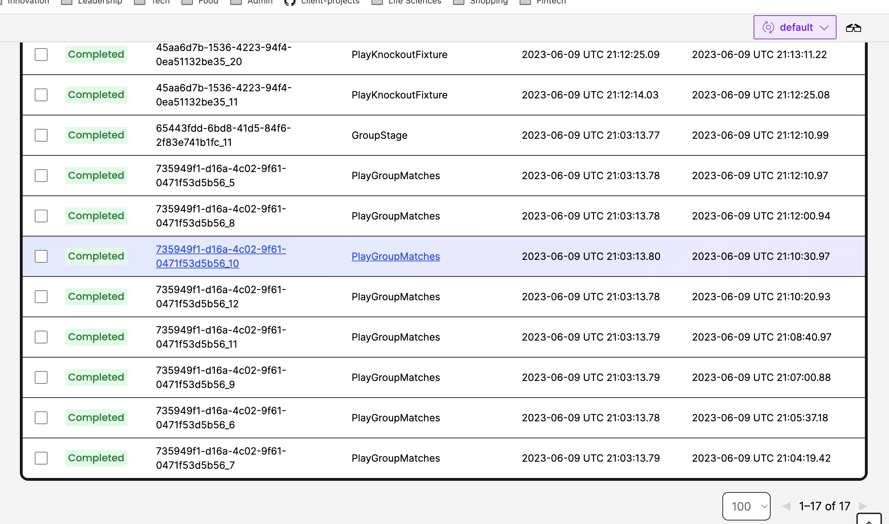
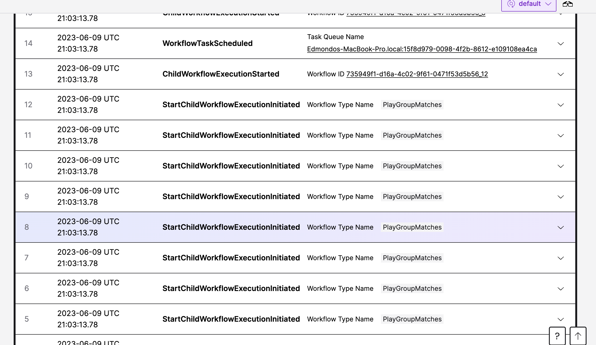
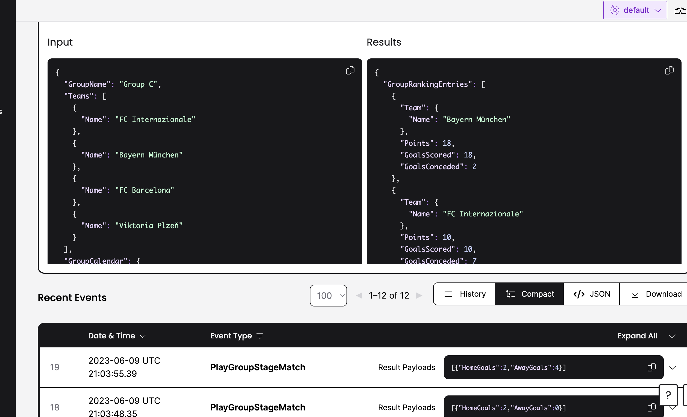

# Implementing Group Stages and Knockout Phase

I updated the model structure to make easier to browse the code and wrote some boilerplate so we can try to build the
overall logic for the Champions League


## Implementing and testing our Drawing Activity

Now that we have the code for the groups, we can correctly implement the DrawGroupStage activity like so

```go
func (d *GroupStageDrawingVenue) DrawGroups(ctx context.Context, input GroupStageDrawInput) (GroupStageDrawResult, error) {
	logger := activity.GetLogger(ctx)
	msg := fmt.Sprintf("Drawing group stages in %s with a total of %d teams", d.Name, input.Participants.TeamCount())
	logger.Info(msg)
	return GroupStageDrawResult{
		Groups: [8]Group{
			GroupA(),
			GroupB(),
			GroupC(),
			GroupD(),
			GroupE(),
			GroupF(),
			GroupG(),
			GroupH(),
		},
	}, nil
}
```

and we can proceed to testing it as well. The entry point for testing in Temporal Go-SDK is `testsuite.WorkflowTestSuite`,
and we can invoke the `NewTestActivityEnvironment` to perform a `RegisterActivity` and `ExecuteActivity` then


```go
func TestGroupStageDraw(t *testing.T) {
	testSuite := &testsuite.WorkflowTestSuite{}
	env := testSuite.NewTestActivityEnvironment()
	var drawing = &GroupStageDrawingVenue{Name: "Monte Carlo"}
	env.RegisterActivity(drawing.DrawGroups)
	groups, err := env.ExecuteActivity(drawing.DrawGroups, GroupStageDrawInput{
		Participants: GetParticipants(),
	})
	require.NoError(t, err)
	var res *GroupStageDrawResult
	require.NoError(t, groups.Get(&res))
	require.Equal(t, 8, len(res.Groups))
}
```

Now that our drawing activity, we can use its input to create the Group Stage

## Relationships are important (although sometimes difficult!)

If we really wouldn't value relationships, we would try to stick all the logic in `ChampionsLeague` workflow. Or exclude
children workflows from the party, and replace them with alternatives such as Object-Oriented Programming. But we are
good people, and we are going to structure our Champions League like so:
- A ChampionsLeague workflow, responsible for coordinating the Group Stage, the Knockout Phase, the drawing, and the final
- A GroupStage workflow, which needs to execute all the groups and return the qualified teams
- A PlayGroupMatches workflow, which can handle all the matches within that group
- A Knockout Phase workflow that orchestrate all the Knockout phase (Round of 16, round of 8, round of 4)
- A PlayKnockoutFixture workflow that orchestrate the two legs of each fixture.

Plus, a bunch of activities (drawing fixtures in the knockout stage, playing matches, etc.).  I want to reiterate that children workflows are not always the right answer, and relationships are often difficult. In this case, for example, Lamport 
Clocks, Conflict-free distributed data types, lambda calculus and path-dependent types would have worked much better. 
If you plan to use Temporal for something more useful than celebrating FC Internazionale fourth Champions League (which 
is very useful, don't get me wrong) I highly recommend you read these two blog post:
- https://docs.temporal.io/workflows#when-to-use-child-workflows
- https://community.temporal.io/t/purpose-of-child-workflows/652/2

### And expressing ourselves is important too

That's why we add logging in software. Software is complex, and sometimes it doesn't express feelings or emotions. Over
time, it can get pretty bad. Logging is the way we address this problem: we make our software talk. However, in the case
of resilient distributed applications with Temporal, we know that the work can be distributed among multiple workers and
that the state of a workflow is restored by event history. How does that impact logging? Well, you don't want to 
**log again**, so you need to use a specialized logger, like so:

```go
func GroupStage(ctx workflow.Context, groupStageDrawResult GroupStageDrawResult) (GroupStageResult, error) {
    logger := workflow.GetLogger(ctx)
    logger.Info("Starting the Group Stage of the UEFA Champions League 2022/2023")
    // Let each group play, and decide how to build each pot for the knockout phase drawing
    return GroupStageResult{}, nil
}
```

### Back to relationships 

So what is our Group Stage workflow going to do? Well, simply, it should submit an instance of a group workflow for each
group, wait for it to terminate, and determine which teams are going to get into the knockout phase. Although the logic
 is pretty simple (the two teams that are at the top of the group ranking make into the final), you can imagine this
is the place where we could handle, for example, a disqualified team (let's say a financial fraud, for example).

What I want to stress out here is that the logic is deterministic: once all the groups have played, 
there is a well-defined process to decide which team makes into the knockout phase. Yes, sometimes you can bribe the
referee, and this is a first-class feature in Temporal (see next chapter) but in general the logic to compute what are
the qualified teams are deterministic.

Now, the code is mostly boilerplate, and awful. You can read it by yourself if you enjoy horror stories. The most 
interesting things there are different patterns for async children workflows.

Let's get back to what we need to really run our entire application. We need to register workers for the new activities:
- `PlayKnockoutRoundLeg`
- `PlayGroupStageMatch`

A stadium, yes, we would need a stadium! But I am lazy, and I am just going to add this to the management team.
Same for the new workflows, as well. Sorry, the final is tomorrow and I don't have time. But the code works, I promise.
Let's now explore the Temporal UI after running as usual all our workers and `edmondo.go` to submit the ChampionsLeague

Now the Temporal UI shows some more stuff!

Multiple workflows with an auto-generated have completed successfully



The event history for the GroupStage shows that children workflows have been triggered



At the top of one of those workflows we can easily inspect inputs and outputs from the workflow




### Testing relationships

Ah, if we could only test relationships! In real life, unfortunately, you can only test live in production.
With Temporal, it's possible to test the interaction between parents and child.

London and Detroit TDD schools have been arguing for decades about whether mocking is good or bad. I consider myself
a pragmatic engineer: I am not interested in the eternal struggle between good and evil, classicist and mockist, so I
in this case I am going to do both!

- Testing the Champions League in Isolation, by mocking the directly invoked activities and the first level children
- Testing the Champions League in integration, by registering all activities and all children workflows


```go
func verifyFcInternazionaleIsWinner(t *testing.T, env *testsuite.TestWorkflowEnvironment) {
	participants := GetParticipants()
	env.ExecuteWorkflow(ChampionsLeague, participants)

	require.True(t, env.IsWorkflowCompleted())
	require.NoError(t, env.GetWorkflowError())
	var result Result
	require.NoError(t, env.GetWorkflowResult(&result))
	require.Equal(t, Team{Name: "FC Internazionale"}, result.Winner)
}

func TestChampionsLeagueIsolation(t *testing.T) {
	testSuite := &testsuite.WorkflowTestSuite{}
	env := testSuite.NewTestWorkflowEnvironment()
	var activity *GroupStageDrawingVenue
	// Mock activity implementation
	env.OnActivity(activity.DrawGroups, mock.Anything, mock.Anything).Return(
		func(ctx context.Context, input GroupStageDrawInput) (GroupStageDrawResult, error) {
			require.Equal(t, input.Participants.TeamCount(), 32)
			return GroupStageDrawResult{}, nil
		})
	env.RegisterWorkflow(GroupStage)
	env.RegisterWorkflow(KnockoutStage)
	env.OnWorkflow(GroupStage, mock.Anything, mock.Anything).Return(
		func(ctx workflow.Context, result GroupStageDrawResult) (GroupStageResult, error) {
			return GroupStageResult{}, nil
		},
	)
	env.OnWorkflow(KnockoutStage, mock.Anything, mock.Anything).Return(
		func(ctx workflow.Context, result GroupStageResult) (Finalists, error) {
			return Finalists{Team1: Team{Name: "Manchester City"}, Team2: Team{Name: "FC Internazionale"}}, nil
		})
	verifyFcInternazionaleIsWinner(t, env)
}

func TestChampionsLeagueIntegration(t *testing.T) {
	testSuite := &testsuite.WorkflowTestSuite{}
	env := testSuite.NewTestWorkflowEnvironment()
	var groupDrawingVenue GroupStageDrawingVenue = GroupStageDrawingVenue{
		LocationName: "Monte Carlo",
	}
	// Mock activity implementation
	env.RegisterActivity(groupDrawingVenue.DrawGroups)
	var knockoutDrawingVenue KnockoutPhaseDrawingVenue = KnockoutPhaseDrawingVenue{
		LocationName: "Nyon",
	}
	// Mock activity implementation
	env.RegisterActivity(knockoutDrawingVenue.DrawFixtures)
	env.RegisterActivity(PlayKnockoutRoundLeg)
	env.RegisterActivity(PlayGroupStageMatch)
	env.RegisterWorkflow(GroupStage)
	env.RegisterWorkflow(PlayGroupMatches)
	env.RegisterWorkflow(KnockoutStage)
	env.RegisterWorkflow(PlayKnockoutFixture)

	verifyFcInternazionaleIsWinner(t, env)
}

```

Next stop: how to satisfy an impatient supporter, how to bribe a referee